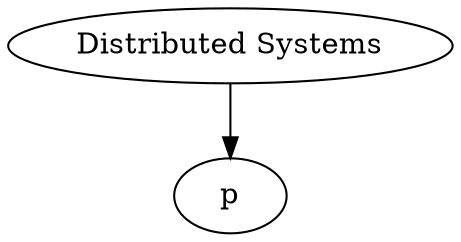

# Origin

The idea behind BrainBranch is to document this phenomena called "Remix". E.g. http://www.musictory.com/music/KRS-One/How+Bad+Do+You+Want+It%3F -> "How bad do you want it". Why? I try to distill the mechanisms that causes people to remix like they do. Even the origin of novel ideas and inventations should be able to be causally explained. This is the attempt in doing so. Why? Nothing less than simplyifing life and learning meta structures of the human beings.

Idea started with my own messy head. I didn't like Todo lists, because they were pure linear and after having 10 items in there, the only way to get some sort of overview was by partitioning the list into several lists with some sort of predicate. But these are again linear and hard to grasp.

Next up was mind maps. More dimensions, visual, and the ability to structure and link items. But mind maps have the problem, that they incorporate time. They are static as todo lists are. They are snapshots of time, of any given point in time you are looking at them or want to process them. There is no notion of what you want to do accomplish and how it has changed over time. How you actually solved a problem is not documented, with all the interesting findings and changes along the way.

## Stack based version

GitBrain (gb)

Needed commands:

0. 
	git init

1. 
	git commit --allow-empty --message="Message"

2. 
	(git checkout master)
	git branch event_1
	(git checkout event_1)

git checkout -b newbranch

## Mindmap based version

### DOT graph

### CouchDB

Using the web gui was nice to quickly enter items

